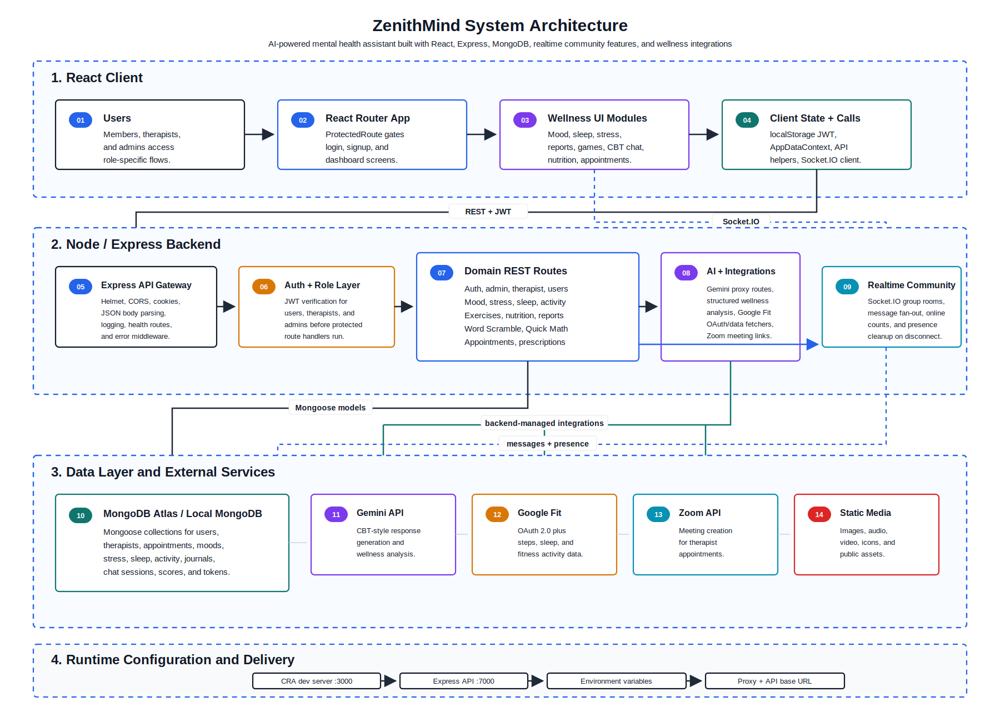

# ZenithMind - AI-Powered Mental Health Assistant

ZenithMind is a full-stack mental wellness platform that combines CBT-informed chatbot support, mood and stress tracking, Google Fit insights, therapist workflows, realtime community spaces, and gamified self-care tools.

The project is built around a React client, an Express/MongoDB API, Gemini-powered AI features, Socket.IO community messaging, and optional health-data integrations. It is designed for students and young professionals who need accessible, private, and structured support between formal care moments.

> Important: ZenithMind is a guided wellness and self-reflection tool. It is not a clinical diagnosis system, crisis service, or replacement for professional mental health care.

---

## Highlights

| Area | What ZenithMind provides |
| --- | --- |
| CBT-informed AI chat | Reflective prompts, thought reframing, coping suggestions, and structured mental-health conversations |
| Mood and stress analytics | Mood logs, stress entries, trend views, dashboard summaries, and progress reports |
| Sleep and relaxation | Sleep tracking, calming audio, relaxation widgets, and mental exercise content |
| Google Fit integration | Activity, sleep, and wellness signals from Google Fit, connected through backend-managed OAuth routes |
| Therapist support | Therapist signup/login, profile management, appointment booking, prescriptions, and user appointments |
| Admin workflows | Role-based admin authentication and dashboards for high-level user and wellness visibility |
| Gamified mental fitness | Memory cards, sequence tap, quick math, word scramble, scores, streaks, and engagement loops |
| Community features | Socket.IO-powered group chat with live message delivery and online user counts |

---

## Research Snapshot

ZenithMind was piloted with 18 undergraduate students and early-career professionals.

| Metric | Result |
| --- | --- |
| Users who found the system easy to use | 83% |
| Users who found the interface visually clear | 72% |
| Task completion without assistance by first-time users | 13 / 18 |
| CBT chatbot responses rated contextually relevant | About 66% |
| Users who found mood visualizations helpful | 72% |
| Users who reported higher engagement through gamification | About 70% |
| Average chatbot response time | Under 2-3 seconds |
| Dashboard visualization accuracy | Over 95% |

---

## Architecture

ZenithMind uses a modular MERN-style architecture with a React frontend, Express API, MongoDB persistence, realtime communication, and external wellness integrations.

<p align="center">
  
</p>

[Open the architecture diagram directly](./assets/architecture.svg)

| Layer | Responsibility | Important files |
| --- | --- | --- |
| React client | User, therapist, and admin experiences with protected navigation | `src/App.js`, `src/components/*`, `src/lib/api.js` |
| API server | Express app, security middleware, CORS, REST routes, and Socket.IO | `server/server.js` |
| Authentication | JWT sessions with user, therapist, and admin role handling | `server/src/routes/auth.routes.js`, `server/src/middleware/auth.js` |
| Wellness modules | Mood, stress, sleep, nutrition, activity, exercises, reports, and game scores | `server/src/routes/*`, `server/src/controllers/*` |
| AI layer | Gemini-backed chat, analysis, and CBT-style reflections | `server/src/routes/ai.routes.js`, `server/src/routes/gemini.routes.js` |
| Data layer | MongoDB/Mongoose models for users, logs, sessions, appointments, tokens, and scores | `server/src/models/*` |
| Integrations | Google Fit OAuth/data sync and Zoom meeting support for therapist sessions | `server/src/routes/googlefit.routes.js`, `server/src/services/zoom.js` |

Primary flow:

1. The React app sends authenticated requests to the Express API.
2. Express validates identity and role permissions before calling controllers/services.
3. MongoDB stores user records, wellness logs, chat sessions, appointments, and game scores.
4. Gemini, Google Fit, and Zoom are called from backend-managed routes.
5. Socket.IO keeps community rooms updated in realtime.

---

## API Surface

The main API server starts from `server/server.js` and listens on port `7000` unless `PORT` is configured.

| Route group | Purpose |
| --- | --- |
| `GET /api/health` | Lightweight server health check |
| `/api/auth` | User registration, login, and account authentication |
| `/api/admin/auth` | Admin authentication and invite-code based access |
| `/api/therapist/auth` | Therapist onboarding and authentication |
| `/api/admin` | Admin dashboard routes protected by admin role checks |
| `/api/mood` | Authenticated mood entries and mood history |
| `/api/stress` | Authenticated stress tracking workflows |
| `/api/sleep` | Sleep logs and relaxation-related data |
| `/api/activity` | Daily activity snapshots and reward-related activity data |
| `/api/nutrition` | Nutrition entries and food-related wellness tracking |
| `/api/exercises` | Mental exercise sessions and related records |
| `/api/appointments` | Therapist appointment booking and management |
| `/api/googlefit` | Google Fit OAuth, sync, analytics, and health-data endpoints |
| `/api/wordscramble` | Word scramble game data and scores |
| `/api/quickmath` | Quick math game data and scores |
| `/api/ai` | AI analysis, chat, and Gemini-backed routes |

Realtime community features use Socket.IO events including `joinGroup`, `sendMessage`, `loadMessages`, `newMessage`, `onlineUsers`, `groupFull`, and `leaveGroup`.

---

## Core Features

### CBT-Informed Chatbot

The AI chat experience supports cognitive restructuring, emotional labeling, guided reflection, and practical coping suggestions. The chatbot is intended to support self-awareness and healthier thought patterns, not to make clinical decisions.

### Mood, Stress, and Progress Tracking

Users can record emotional states, stress levels, lifestyle context, and daily progress. Dashboards and report pages turn these entries into trends that make patterns easier to recognize over time.

### Health and Activity Signals

Google Fit routes connect physical activity and wellness data with the broader mental-health dashboard. This makes it possible to explore relationships between activity, sleep, stress, and mood.

### Therapist and Appointment Flow

Therapists can manage profiles, view appointment information, and support users through booking and prescription-related workflows. Zoom support is available when the required credentials are configured.

### Mental Fitness Games

The app includes lightweight cognitive games such as memory cards, quick math, sequence tap, and word scramble. These add motivation and give users small, repeatable engagement loops.

### Realtime Community

Socket.IO group rooms allow users to join community spaces, exchange messages, and see live online counts.

---

## Tech Stack

| Layer | Technology |
| --- | --- |
| Frontend | React 19, Create React App, React Router, Bootstrap, React Bootstrap, Framer Motion |
| Backend | Node.js, Express, Socket.IO, Helmet, Morgan, Cookie Parser |
| Database | MongoDB and Mongoose |
| Authentication | JWT with role-aware middleware |
| AI | Google Gemini API |
| Health data | Google Fit REST APIs with OAuth |
| Video meetings | Zoom server-to-server OAuth support |
| Charts and UI | Recharts, React Icons, Lucide React |
| Optional Python services | Mood prediction scripts under `server/` and `realtime/` |

---

## Project Structure

```text
zenithmind/
|-- assets/
|   `-- architecture.svg
|-- public/
|-- realtime/
|   `-- Moodify.py
|-- server/
|   |-- server.js
|   |-- index.js
|   |-- mood_api.py
|   |-- package.json
|   `-- src/
|       |-- config/
|       |-- controllers/
|       |-- middleware/
|       |-- models/
|       |-- routes/
|       |-- services/
|       `-- utils/
|-- src/
|   |-- api/
|   |-- components/
|   |-- context/
|   |-- lib/
|   `-- App.js
|-- package.json
|-- package-lock.json
`-- README.md
```

---

## Getting Started

### Quick local setup

Use this path when you want to run the full app locally for development:

```bash
git clone https://github.com/ParthrChandurkar/-ZenithMind-AI-Powered-Mental-Health-Assistant.git
cd -ZenithMind-AI-Powered-Mental-Health-Assistant
npm install
cd server
npm install
cd ..
cp server/.env.example server/.env
cp .env.example .env
```

After filling in the required values, start the API from `server/` and the React app from the project root in separate terminals:

```bash
cd server
npm run dev
```

```bash
npm start
```

The frontend opens at `http://localhost:3000`, and the backend health check is available at `http://localhost:7000/api/health`.

### Prerequisites

- Node.js 18 or newer
- npm
- MongoDB Atlas or a local MongoDB instance
- Google Gemini API key
- Google Cloud project with the Fitness API enabled, if using Google Fit
- Zoom server-to-server OAuth credentials, if using meeting creation

### Clone the repository

```bash
git clone https://github.com/ParthrChandurkar/-ZenithMind-AI-Powered-Mental-Health-Assistant.git
cd -ZenithMind-AI-Powered-Mental-Health-Assistant
```

### Install dependencies

Install frontend dependencies from the project root:

```bash
npm install
```

Install backend dependencies from the `server` directory:

```bash
cd server
npm install
cd ..
```

### Configure environment variables

Start from the included templates:

```bash
cp .env.example .env
cp server/.env.example server/.env
```

Configure the frontend `.env` file in the project root:

| Variable | Purpose | Required |
| --- | --- | --- |
| `REACT_APP_API_BASE` | Base URL for REST API requests, usually `http://localhost:7000` | Yes |
| `REACT_APP_BACKEND_URL` | Socket.IO backend URL for community features | Yes |
| `REACT_APP_MOOD_API` | Optional Python mood prediction service URL | Optional |
| `REACT_APP_GEMINI_API_KEY` | Browser-side Gemini fallback for legacy chat components | Optional |

```env
REACT_APP_API_BASE=http://localhost:7000
REACT_APP_BACKEND_URL=http://localhost:7000
REACT_APP_MOOD_API=http://localhost:5055/api/mood/predict
REACT_APP_GEMINI_API_KEY=
```

Configure the backend `.env` file inside `server/`:

| Variable | Purpose | Required |
| --- | --- | --- |
| `PORT` | Express API port, defaults to `7000` | No |
| `NODE_ENV` | Runtime mode, usually `development` or `production` | Yes |
| `FRONTEND_URL` | Primary frontend origin for CORS | Yes |
| `ALLOWED_ORIGINS` | Comma-separated production CORS allowlist | Production |
| `MONGO_URI` | MongoDB connection string | Yes |
| `MONGODB_DBNAME` | Database name, defaults to `ZenithMind` | No |
| `JWT_SECRET` | Secret used to sign user, therapist, and admin tokens | Yes |
| `ADMIN_INVITE_CODE` | Invite code required for admin registration/access | Yes |
| `GEMINI_API_KEY` | Server-side Gemini key for AI routes | Yes for AI |
| `GOOGLE_CLIENT_ID`, `GOOGLE_CLIENT_SECRET`, `GOOGLE_REDIRECT_URI` | Google Fit OAuth configuration | For Google Fit |
| `ZOOM_ACCOUNT_ID`, `ZOOM_CLIENT_ID`, `ZOOM_CLIENT_SECRET`, `ZOOM_HOST` | Zoom meeting creation credentials | For Zoom |
| `ZOOM_WEBHOOK_TOKEN`, `ZOOM_FALLBACK_HOST_EMAIL` | Optional Zoom webhook and fallback host settings | Optional |

```env
PORT=7000
NODE_ENV=development
FRONTEND_URL=http://localhost:3000
ALLOWED_ORIGINS=http://localhost:3000

MONGO_URI=your_mongodb_connection_string
MONGODB_DBNAME=ZenithMind
JWT_SECRET=replace_with_a_long_random_secret
ADMIN_INVITE_CODE=replace_with_an_admin_invite_code

GEMINI_API_KEY=your_gemini_api_key

GOOGLE_CLIENT_ID=your_google_client_id
GOOGLE_CLIENT_SECRET=your_google_client_secret
GOOGLE_REDIRECT_URI=http://localhost:7000/api/googlefit/oauth2callback

ZOOM_ACCOUNT_ID=
ZOOM_CLIENT_ID=
ZOOM_CLIENT_SECRET=
ZOOM_HOST=
ZOOM_WEBHOOK_TOKEN=
ZOOM_FALLBACK_HOST_EMAIL=
```

Do not commit real secrets. Keep production keys in a secure deployment environment, use a long random `JWT_SECRET`, and remember that any `REACT_APP_*` value is exposed to the browser bundle.

### Run the app

Start the backend API:

```bash
cd server
npm run dev
```

Start the React app in another terminal:

```bash
npm start
```

Open `http://localhost:3000` in your browser. The API runs on `http://localhost:7000` by default.

---

## Available Scripts

Frontend scripts from the project root:

| Command | Description |
| --- | --- |
| `npm start` | Start the React development server |
| `npm test` | Run the Create React App test runner |
| `npm run build` | Create a production build in `build/` |
| `npm run eject` | Eject Create React App configuration |

Backend scripts from `server/`:

| Command | Description |
| --- | --- |
| `npm run dev` | Start the Express API with Nodemon |
| `npm start` | Start the Express API with Node |

---

## Development Checks

Use these checks before opening a pull request or deploying a build:

| Check | Command |
| --- | --- |
| Frontend production build | `npm run build` |
| Frontend test runner | `npm test -- --watchAll=false` |
| Backend boot check | `cd server && npm start` |
| API health check | Open `http://localhost:7000/api/health` after the server starts |

For feature changes, also smoke test the affected user flow in the browser, such as chatbot messaging, mood logging, appointment booking, Google Fit connection, or community chat.

---

## Troubleshooting

| Problem | What to check |
| --- | --- |
| Frontend cannot reach the API | Confirm `REACT_APP_API_BASE`, `REACT_APP_BACKEND_URL`, and the backend port match |
| MongoDB connection fails | Verify `MONGO_URI`, network access, database credentials, and IP allowlisting |
| AI routes return configuration errors | Ensure `GEMINI_API_KEY` is set in `server/.env` |
| Google Fit OAuth fails | Confirm Fitness API access, OAuth consent settings, and `GOOGLE_REDIRECT_URI` |
| Community chat does not update live | Check that Socket.IO can connect to the backend URL and CORS origin |
| Zoom meeting creation fails | Verify server-to-server OAuth credentials and fallback host settings |

---

## Contributing

1. Create a focused branch for the change.
2. Keep updates scoped to one feature, fix, or documentation improvement.
3. Update the README or environment examples when setup behavior changes.
4. Run the relevant development checks before committing.
5. Avoid committing secrets, generated build folders, local logs, or private health data.

---

## Mental Health Scope

ZenithMind is built for wellness support, reflection, habit tracking, and educational CBT-style guidance. It should not be used as an emergency tool or as a substitute for a licensed clinician.

If a user may be in immediate danger or crisis, they should contact local emergency services or a trusted crisis helpline right away.

---

## Comparative Positioning

ZenithMind focuses on bringing several mental wellness workflows into one system.

| Feature | ZenithMind | Meditation apps | Chatbot apps | Habit apps |
| --- | :---: | :---: | :---: | :---: |
| CBT-informed chatbot | Yes | Limited | Yes | Limited |
| Mood analytics dashboard | Yes | Limited | Limited | Limited |
| Google Fit or wearable signals | Yes | Limited | Limited | Limited |
| Therapist workflows | Yes | Limited | Limited | No |
| Gamified mental fitness | Yes | Limited | Limited | Yes |
| Realtime community support | Yes | Limited | Limited | Limited |
| Structured reports | Yes | Limited | Limited | Limited |

---

## Limitations

- Mood and stress entries are self-reported, so data can be subjective.
- AI responses may be helpful but are not clinical judgments.
- Google Fit sync depends on third-party API availability and user permissions.
- Personalized insights improve as more user history becomes available.
- Production deployments need strong secret management, HTTPS, monitoring, and data-privacy review.

---

## Roadmap

- Voice-based reflection and CBT sessions
- Passive stress prediction from wearable signals
- Deeper multilingual and culturally localized wellness content
- Expanded therapist dashboards and institutional reporting
- Larger longitudinal validation studies
- More robust safety escalation and crisis-resource routing

---

## Research Paper

This project is documented in the research paper:

> "ZenithMind: Mental Health Assistant with CBT Integration"
>
> Aditya Badgujar, Prathamesh Walishetty, Parth Chandurkar, Anurag Gupta (VIIT Pune), Riddhi Mirajkar (VIT Pune), and Rishikaysh Kaakandikar (SBIMS Pune)

---

## License

This project is developed for academic and research purposes. See `LICENSE` for details if a license file is added to the repository.
